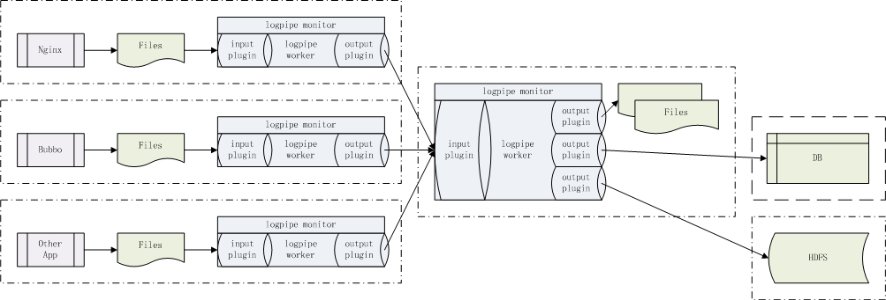
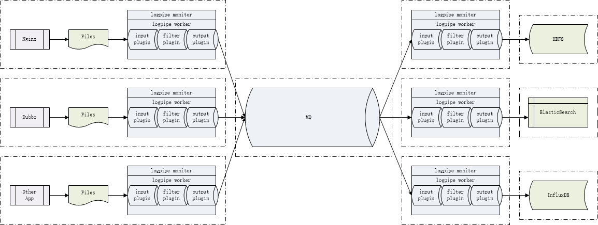
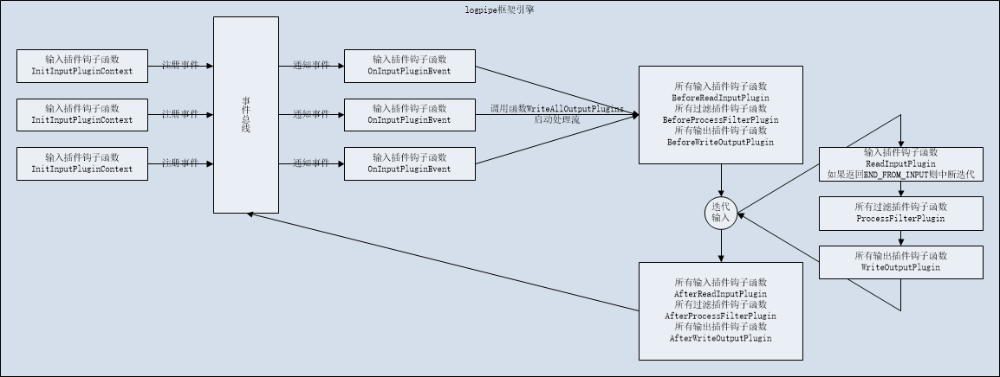

日志采集工具(logpipe)
====================
<!-- TOC -->

- [日志采集工具(logpipe)](#%E6%97%A5%E5%BF%97%E9%87%87%E9%9B%86%E5%B7%A5%E5%85%B7logpipe)
- [1. 概述](#1-%E6%A6%82%E8%BF%B0)
- [2. 安装](#2-%E5%AE%89%E8%A3%85)
	- [2.1. 源码编译安装](#21-%E6%BA%90%E7%A0%81%E7%BC%96%E8%AF%91%E5%AE%89%E8%A3%85)
		- [2.1.1. 编译安装logpipe](#211-%E7%BC%96%E8%AF%91%E5%AE%89%E8%A3%85logpipe)
		- [2.1.2. 编译安装自带logpipe插件](#212-%E7%BC%96%E8%AF%91%E5%AE%89%E8%A3%85%E8%87%AA%E5%B8%A6logpipe%E6%8F%92%E4%BB%B6)
		- [2.1.3. 编译安装自带选安装logpipe插件](#213-%E7%BC%96%E8%AF%91%E5%AE%89%E8%A3%85%E8%87%AA%E5%B8%A6%E9%80%89%E5%AE%89%E8%A3%85logpipe%E6%8F%92%E4%BB%B6)
			- [2.1.3.1. logpipe-output-hdfs](#2131-logpipe-output-hdfs)
			- [2.1.3.2. logpipe-output-es](#2132-logpipe-output-es)
		- [2.1.4. 确认安装](#214-%E7%A1%AE%E8%AE%A4%E5%AE%89%E8%A3%85)
- [3. 使用](#3-%E4%BD%BF%E7%94%A8)
	- [3.1. 案例A](#31-%E6%A1%88%E4%BE%8Ba)
		- [3.1.1. 部署归集端](#311-%E9%83%A8%E7%BD%B2%E5%BD%92%E9%9B%86%E7%AB%AF)
		- [3.1.2. 部署采集端](#312-%E9%83%A8%E7%BD%B2%E9%87%87%E9%9B%86%E7%AB%AF)
		- [3.1.3. 测试](#313-%E6%B5%8B%E8%AF%95)
		- [3.1.4. 停止logpipe](#314-%E5%81%9C%E6%AD%A2logpipe)
		- [3.1.5. 其它注意事项](#315-%E5%85%B6%E5%AE%83%E6%B3%A8%E6%84%8F%E4%BA%8B%E9%A1%B9)
- [4. 参考](#4-%E5%8F%82%E8%80%83)
	- [4.1. logpipe](#41-logpipe)
	- [4.2. 自带插件](#42-%E8%87%AA%E5%B8%A6%E6%8F%92%E4%BB%B6)
		- [4.2.1. logpipe-input-file](#421-logpipe-input-file)
		- [4.2.2. logpipe-output-file](#422-logpipe-output-file)
		- [4.2.3. logpipe-input-tcp](#423-logpipe-input-tcp)
		- [4.2.4. logpipe-output-tcp](#424-logpipe-output-tcp)
		- [4.2.5. logpipe-input-exec](#425-logpipe-input-exec)
		- [4.2.6. logpipe-output-hdfs](#426-logpipe-output-hdfs)
		- [4.2.7. logpipe-output-es](#427-logpipe-output-es)
- [5. 插件开发](#5-%E6%8F%92%E4%BB%B6%E5%BC%80%E5%8F%91)
	- [5.1. 输入插件](#51-%E8%BE%93%E5%85%A5%E6%8F%92%E4%BB%B6)
	- [5.2. 输出插件](#52-%E8%BE%93%E5%87%BA%E6%8F%92%E4%BB%B6)
	- [5.3. 过滤插件](#53-%E8%BF%87%E6%BB%A4%E6%8F%92%E4%BB%B6)
- [6. 性能压测](#6-%E6%80%A7%E8%83%BD%E5%8E%8B%E6%B5%8B)
	- [6.1. flume-ng](#61-flume-ng)
	- [6.2. logpipe](#62-logpipe)
	- [6.3. 总结](#63-%E6%80%BB%E7%BB%93)
- [7. 内部实现](#7-%E5%86%85%E9%83%A8%E5%AE%9E%E7%8E%B0)
	- [7.1. logpipe框架引擎](#71-logpipe%E6%A1%86%E6%9E%B6%E5%BC%95%E6%93%8E)
	- [7.2. 输入插件](#72-%E8%BE%93%E5%85%A5%E6%8F%92%E4%BB%B6)
		- [7.2.1. 文件输入插件`logpipe-input-file`](#721-%E6%96%87%E4%BB%B6%E8%BE%93%E5%85%A5%E6%8F%92%E4%BB%B6logpipe-input-file)
		- [7.2.2. TCP输入插件`logpipe-input-tcp`](#722-tcp%E8%BE%93%E5%85%A5%E6%8F%92%E4%BB%B6logpipe-input-tcp)
		- [7.2.3. 长命令输入插件`logpipe-input-exec`](#723-%E9%95%BF%E5%91%BD%E4%BB%A4%E8%BE%93%E5%85%A5%E6%8F%92%E4%BB%B6logpipe-input-exec)
		- [7.2.4. Kafka输入插件`logpipe-input-kafka`](#724-kafka%E8%BE%93%E5%85%A5%E6%8F%92%E4%BB%B6logpipe-input-kafka)
	- [7.3. 过滤插件](#73-%E8%BF%87%E6%BB%A4%E6%8F%92%E4%BB%B6)
	- [7.4. 输出插件](#74-%E8%BE%93%E5%87%BA%E6%8F%92%E4%BB%B6)
		- [7.4.1. 文件输出插件`logpipe-output-file`](#741-%E6%96%87%E4%BB%B6%E8%BE%93%E5%87%BA%E6%8F%92%E4%BB%B6logpipe-output-file)
		- [7.4.2. TCP输出插件`logpipe-output-tcp`](#742-tcp%E8%BE%93%E5%87%BA%E6%8F%92%E4%BB%B6logpipe-output-tcp)
		- [7.4.3. 屏幕输出插件`logpipe-output-stdout`](#743-%E5%B1%8F%E5%B9%95%E8%BE%93%E5%87%BA%E6%8F%92%E4%BB%B6logpipe-output-stdout)
		- [7.4.4. Kafka输出插件`logpipe-output-kafka`](#744-kafka%E8%BE%93%E5%87%BA%E6%8F%92%E4%BB%B6logpipe-output-kafka)
		- [7.4.5. ES输出插件`logpipe-output-es`](#745-es%E8%BE%93%E5%87%BA%E6%8F%92%E4%BB%B6logpipe-output-es)
		- [7.4.6. HDFS输出插件`logpipe-output-hdfs`](#746-hdfs%E8%BE%93%E5%87%BA%E6%8F%92%E4%BB%B6logpipe-output-hdfs)
- [8. 最后](#8-%E6%9C%80%E5%90%8E)

<!-- /TOC -->
# 1. 概述

在集群化环境里，日志采集是重要基础设施。

开源主流解决方案是基于flume-ng，但在实际使用中发现flume-ng存在诸多问题，比如flume-ng的spoolDir采集器只能对文件名转档后的大小不能变化的最终日志文件进行采集，不能满足采集时效性要求，如果要采集正在被不断追加的日志文件，只能用exec采集器搭配tail -F命令，但tail -F命令又不能通配目标目录中将来新增的未知文件名。其它解决方案如logstash由于是JAVA开发，内存占用和性能都不能达到最优。

作为一个日志采集的本地代理，内存占用应该小而受控，性能应该高效，耗费CPU低对应用影响尽可能小，要能异步实时追踪日志文件增长，某些应用会在目标目录下产生多个日志文件甚至现在不能确定将来的日志文件名，架构上要支持多输入多输出流式日志采集传输，为了达成以上需求，我研究了所需技术，评估实现难度并不高，就自研了logpipe。

logpipe是一个分布式、高可用的用于采集、传输、对接落地的日志工具，采用了插件风格的框架结构设计，支持多输入、多过滤、多输出按需配置组件用于流式日志收集架构，无第三方依赖。

logpipe的一种用法是能异步实时监控集群里的所有日志目录，一旦有文件新增或追加写，立即采集并传输到大存储上以相同日志文件名合并落地，或者写入HDFS。异步意味着不影响应用输出日志的性能，实时意味着一有日志立即采集，很多日志采集工具如flume-ng、logstash介绍文档通篇不提采集方式是否实时还是周期性的，这很关键。

以下是两种常用架构：





logpipe概念朴实、使用方便、配置简练，没有如sink等一大堆新名词。

logpipe由若干个input、事件总线和若干个output组成。启动logpipe管理进程(monitor)，派生一个工作进程(worker)，监控工作进程崩溃则重启工作进程。工作进程装载配置加载若干个input插件和若干个output插件，进入事件循环，任一input插件产生消息后输出给所有output插件。

logpipe自带了5个插件（今后将开发更多插件），分别是：
* logpipe-input-file 用inotify异步实时监控日志目录，一旦有文件新建或文件增长事件发生（注意：不是周期性轮询文件修改时间和大小），立即捕获文件名和读取文件追加数据。该插件拥有文件大小转档功能，用以替代应用日志库对应功能，提高应用日志库写日志性能。该插件支持数据压缩。
* logpipe-output-file 一旦输入插件有消息产生后用相同的文件名落地文件数据。该插件支持数据解压。
* logpipe-input-tcp 创建TCP服务侦听端，接收客户端连接，一旦客户端连接上有新消息到来，立即读取。
* logpipe-output-tcp 创建TCP客户端，连接服务端，一旦输入插件有消息产生后输出到该连接。
* logpipe-input-exec 执行长命令并捕获输出
* logpipe-output-hdfs 一旦输入插件有消息产生后用相同的文件名落地到HDFS中。该插件支持数据解压。

使用者可根据自身需求，按照插件开发规范，开发定制插件，如IBMMQ输入插件、HDFS输出插件等。

logpipe配置采用JSON格式，层次分明，编写简洁，如示例：

```
{
	"log" : 
	{
		"log_file" : "/tmp/logpipe_case1_collector.log" ,
		"log_level" : "INFO"
	} ,
	
	"inputs" : 
	[
		{ "plugin":"so/logpipe-input-file.so" , "path":"/home/calvin/log" }
	] ,
	
	"filters" :
	[
		{ "plugin":"so/logpipe-filter-log.so" }
	] ,
	
	"outputs" : 
	[
		{ "plugin":"so/logpipe-output-tcp.so" , "ip":"127.0.0.1" , "port":10101 }
	]
}

```

# 2. 安装

## 2.1. 源码编译安装

### 2.1.1. 编译安装logpipe

从[开源中国](https://gitee.com/calvinwilliams/logpipe)或[github](https://github.com/calvinwilliams/logpipe)克隆或下载最新源码包，放到你的源码编译目录中解开。以下假设你的操作系统是Linux：

进入`src`目录，编译得到可执行程序`logpipe`和动态库`liblogpipe_api.so`。

```
$ cd src
$ make -f makefile.Linux
gcc -g -fPIC -O2 -Wall -Werror -fno-strict-aliasing -I. -I/home/calvin/include -std=gnu99  -c list.c
gcc -g -fPIC -O2 -Wall -Werror -fno-strict-aliasing -I. -I/home/calvin/include -std=gnu99  -c rbtree.c
gcc -g -fPIC -O2 -Wall -Werror -fno-strict-aliasing -I. -I/home/calvin/include -std=gnu99  -c fasterjson.c
gcc -g -fPIC -O2 -Wall -Werror -fno-strict-aliasing -I. -I/home/calvin/include -std=gnu99  -c LOGC.c
gcc -g -fPIC -O2 -Wall -Werror -fno-strict-aliasing -I. -I/home/calvin/include -std=gnu99  -c config.c
gcc -g -fPIC -O2 -Wall -Werror -fno-strict-aliasing -I. -I/home/calvin/include -std=gnu99  -c env.c
gcc -g -fPIC -O2 -Wall -Werror -fno-strict-aliasing -I. -I/home/calvin/include -std=gnu99  -c util.c
gcc -g -fPIC -O2 -Wall -Werror -fno-strict-aliasing -I. -I/home/calvin/include -std=gnu99  -c output.c
gcc -g -fPIC -O2 -Wall -Werror -fno-strict-aliasing -o liblogpipe_api.so list.o rbtree.o fasterjson.o LOGC.o config.o env.o util.o output.o -shared -L. -L/home/calvin/lib -rdynamic -ldl -lz 
gcc -g -fPIC -O2 -Wall -Werror -fno-strict-aliasing -I. -I/home/calvin/include -std=gnu99  -c main.c
gcc -g -fPIC -O2 -Wall -Werror -fno-strict-aliasing -I. -I/home/calvin/include -std=gnu99  -c monitor.c
gcc -g -fPIC -O2 -Wall -Werror -fno-strict-aliasing -I. -I/home/calvin/include -std=gnu99  -c worker.c
gcc -g -fPIC -O2 -Wall -Werror -fno-strict-aliasing -o logpipe main.o monitor.o worker.o -L. -L/home/calvin/lib -rdynamic -ldl -lz  -llogpipe_api
```

可执行程序logpipe就是日志采集本地代理，动态库liblogpipe_api.so给插件开发用。

然后安装编译目标，默认`logpipe`安装到`$HOME/bin`、`liblogpipe_api.so`安装到`$HOME/lib`、`logpipe_api.h`等一些头文件安装到`$HOME/include/logpipe`，如果需要改变安装目录，修改`makeinstall`里的`_HDERINST`、`_LIBINST`和`_BININST`。

```
$ make -f makefile.Linux install
rm -f /home/calvin/bin/logpipe
cp -rf logpipe /home/calvin/bin/
rm -f /home/calvin/lib/liblogpipe_api.so
cp -rf liblogpipe_api.so /home/calvin/lib/
rm -f /home/calvin/include/logpipe/rbtree.h
cp -rf rbtree.h /home/calvin/include/logpipe/
rm -f /home/calvin/include/logpipe/LOGC.h
cp -rf LOGC.h /home/calvin/include/logpipe/
rm -f /home/calvin/include/logpipe/fasterjson.h
cp -rf fasterjson.h /home/calvin/include/logpipe/
rm -f /home/calvin/include/logpipe/rbtree_tpl.h
cp -rf rbtree_tpl.h /home/calvin/include/logpipe/
rm -f /home/calvin/include/logpipe/logpipe_api.h
cp -rf logpipe_api.h /home/calvin/include/logpipe/
```

### 2.1.2. 编译安装自带logpipe插件

进入`src`同级的`src-plugins`，编译插件

```
$ cd ../src-plugins
$ make -f makefile.Linux 
gcc -g -fPIC -O2 -Wall -Werror -fno-strict-aliasing -I. -I/home/calvin/include -std=gnu99 -I/home/calvin/include/logpipe  -c logpipe-input-file.c
gcc -g -fPIC -O2 -Wall -Werror -fno-strict-aliasing -o logpipe-input-file.so logpipe-input-file.o -shared -L. -L/home/calvin/so -L/home/calvin/lib -llogpipe_api -rdynamic 
gcc -g -fPIC -O2 -Wall -Werror -fno-strict-aliasing -I. -I/home/calvin/include -std=gnu99 -I/home/calvin/include/logpipe  -c logpipe-output-file.c
gcc -g -fPIC -O2 -Wall -Werror -fno-strict-aliasing -o logpipe-output-file.so logpipe-output-file.o -shared -L. -L/home/calvin/so -L/home/calvin/lib -llogpipe_api -rdynamic 
gcc -g -fPIC -O2 -Wall -Werror -fno-strict-aliasing -I. -I/home/calvin/include -std=gnu99 -I/home/calvin/include/logpipe  -c logpipe-input-tcp.c
gcc -g -fPIC -O2 -Wall -Werror -fno-strict-aliasing -o logpipe-input-tcp.so logpipe-input-tcp.o -shared -L. -L/home/calvin/so -L/home/calvin/lib -llogpipe_api -rdynamic 
gcc -g -fPIC -O2 -Wall -Werror -fno-strict-aliasing -I. -I/home/calvin/include -std=gnu99 -I/home/calvin/include/logpipe  -c logpipe-output-tcp.c
gcc -g -fPIC -O2 -Wall -Werror -fno-strict-aliasing -o logpipe-output-tcp.so logpipe-output-tcp.o -shared -L. -L/home/calvin/so -L/home/calvin/lib -llogpipe_api -rdynamic 
```

然后安装编译目标，默认自带插件安装到`$HOME/so`，如果需要改变安装目录，修改`makeinstall`里的`_LIBINST`。

```
$ make -f makefile.Linux install
rm -f /home/calvin/so/logpipe-input-file.so
cp -rf logpipe-input-file.so /home/calvin/so/
rm -f /home/calvin/so/logpipe-output-file.so
cp -rf logpipe-output-file.so /home/calvin/so/
rm -f /home/calvin/so/logpipe-input-tcp.so
cp -rf logpipe-input-tcp.so /home/calvin/so/
rm -f /home/calvin/so/logpipe-output-tcp.so
cp -rf logpipe-output-tcp.so /home/calvin/so/
```

### 2.1.3. 编译安装自带选安装logpipe插件

#### 2.1.3.1. logpipe-output-hdfs

注意先修改好里你的编译链接环境，包含但不限于

`~/.bash_profile`

```
# for hadoop
export HADOOP_HOME=/home/hdfs/expack/hadoop
export PATH=$HADOOP_HOME/bin:$PATH
export HADOOP_CLASSPATH=`hadoop classpath --glob`
export CLASSPATH=$HADOOP_CLASSPATH:$CLASSPATH
export LD_LIBRARY_PATH=$HADOOP_HOME/lib/native:$LD_LIBRARY_PATH
export LD_LIBRARY_PATH=$JAVA_HOME/jre/lib/amd64/server:$LD_LIBRARY_PATH
```

`makefile.Linux`

```
...
CFLAGS_hdfs                     =       $(CFLAGS) -I/home/hdfs/expack/hadoop/include
...
LFLAGS_hdfs                     =       $(LFLAGS) -L/home/hdfs/expack/hadoop/lib/native -lhdfs -L$(HOME)/expack/jdk1.8.0_152/jre/lib/amd64/server -ljvm
...
```

在`src-plugins`，手工编译插件并复制到`$HOME/so`目录

```
$ make -f makefile.Linux logpipe-output-hdfs.so
gcc -g -fPIC -O2 -Wall -Werror -fno-strict-aliasing -I. -I/home/calvin/include -std=gnu99 -I/home/calvin/include/logpipe  -I/home/hdfs/expack/hadoop/include -c logpipe-output-hdfs.c
gcc -g -fPIC -O2 -Wall -Werror -fno-strict-aliasing -o logpipe-output-hdfs.so logpipe-output-hdfs.o -shared -L. -L/home/calvin/so -L/home/calvin/lib -llogpipe_api -rdynamic  -L/home/hdfs/expack/hadoop/lib/native -lhdfs -L/home/calvin/expack/jdk1.8.0_152/jre/lib/amd64/server -ljvm
$ cp logpipe-output-hdfs.so ~/so/
```

#### 2.1.3.2. logpipe-output-es

```
$ make logpipe-output-es.so && cp logpipe-output-es.so ~/so/
gcc -g -fPIC -O2 -Wall -Werror -fno-strict-aliasing -std=gnu99 -I. -I/home/dep_lhh/include -std=gnu99 -I/home/dep_lhh/include/logpipe  -c logpipe-output-es.c
gcc -g -fPIC -O2 -Wall -Werror -fno-strict-aliasing -std=gnu99 -I. -I/home/dep_lhh/include -std=gnu99 -I/home/dep_lhh/include/logpipe  -c fasterhttp.c
gcc -g -fPIC -O2 -Wall -Werror -fno-strict-aliasing -std=gnu99 -o logpipe-output-es.so logpipe-output-es.o fasterhttp.o -shared -L. -L/home/dep_lhh/so -L/home/dep_lhh/lib -llogpipe_api -rdynamic 
$ cp logpipe-output-es.so ~/so/
```

### 2.1.4. 确认安装

确认`$HOME/bin`已经加入到`$PATH`中，不带参数执行`logpipe`，输出以下信息表示源码编译安装成功

```
$ logpipe
USAGE : logpipe -v
        logpipe -f (config_file) [ --no-daemon ] [ --start-once-for-env "(key) (value)" ]
```

用参数`-v`可以查看当前版本号

```
$ logpipe -v
logpipe v0.9.0 build Dec 19 2017 22:44:54
```

# 3. 使用

注意：如果使用logpipe-input-file插件，建议调大系统inotify队列限制参数，添加sysctl.conf.add中内容到/etc/sysctl.conf并刷新配置`sysctl -p`（需要root权限），否则可能会丢失日志。

注意：安装包中自带配置示例的log.log_level日志等级可能为DEBUG，会输出大量日志，影响性能也占用大量硬盘空间，请提升为WARN或INFO等级。

## 3.1. 案例A

异步实时采集`ecif@158.1.0.56:~/log/*`、`ecif@158.1.0.57:~/log/*`、`ecif@158.1.0.58:~/log/*`下的新建和追加日志文件，归集到`iblog@158.1.0.55:~/log`下。

### 3.1.1. 部署归集端

在ecif@158.1.0.55:~/etc新建配置文件logpipe.conf

```
{
        "log" : 
        {
                "log_file" : "/tmp/logpipe_iblog.log" ,
                "log_level" : "INFO"
        } ,

        "inputs" : 
        [
                { "plugin":"so/logpipe-input-tcp.so" , "ip":"158.1.0.55" , "port":5151 }
        ] ,

        "outputs" : 
        [
                { "plugin":"so/logpipe-output-file.so" , "path":"/home/iblog/log" }
        ]
}
```

启动logpipe

```
$ logpipe -f $HOME/etc/logpipe.conf
2017-12-17 20:19:21.358464 | INFO  | 36318:logpipe-output-file.c:29 | path[/home/iblog/log]
2017-12-17 20:19:21.358513 | INFO  | 36318:logpipe-output-file.c:44 | uncompress_algorithm[(null))]
2017-12-17 20:19:21.358515 | DEBUG | 36318:config.c:321 | [so/logpipe-output-file.so]->pfuncLoadOutputPluginConfig ok
2017-12-17 20:19:21.358520 | INFO  | 36318:logpipe-input-tcp.c:214 | ip[158.1.0.55]
2017-12-17 20:19:21.358522 | INFO  | 36318:logpipe-input-tcp.c:221 | port[5151]
2017-12-17 20:19:21.358525 | DEBUG | 36318:config.c:338 | [so/logpipe-input-tcp.so]->pfuncLoadInputPluginConfig ok
```

回到命令行界面，进程自动转换为守护进程，确认进程

```
$ ps -ef | grep logpipe | grep -v grep
...
iblog   36320     1  0 20:19 ?        00:00:00 logpipe -f logpipe.conf
iblog   36321 36320  0 20:19 ?        00:00:00 logpipe -f logpipe.conf
...
```

查看日志，确认无ERROR及以上等级日志报错

```
$ cat /tmp/logpipe_iblog.log
2017-12-17 20:19:21.358944 | INFO  | 36320:monitor.c:149 | --- monitor begin ---------
2017-12-17 20:19:21.359079 | INFO  | 36320:monitor.c:91 | parent : [36320] fork [36321]
2017-12-17 20:19:21.359142 | INFO  | 36320:monitor.c:85 | child : [36320] fork [36321]
2017-12-17 20:19:21.359176 | INFO  | 36321:worker.c:32 | epoll_create ok , epoll_fd[1]
2017-12-17 20:19:21.359244 | INFO  | 36321:logpipe-input-tcp.c:281 | listen[158.1.0.55:5151][2] ok
2017-12-17 20:19:21.359259 | INFO  | 36321:env.c:54 | epoll_ctl[1] add input plugin fd[2] EPOLLIN ok
2017-12-17 20:19:21.359264 | INFO  | 36321:worker.c:44 | InitEnvironment ok
2017-12-17 20:19:21.359268 | INFO  | 36321:worker.c:59 | epoll_ctl[1] add quit pipe fd[0] ok
2017-12-17 20:19:21.359270 | INFO  | 36321:worker.c:67 | epoll_wait[1] ...
2017-12-17 20:19:23.663377 | INFO  | 36321:worker.c:84 | epoll_wait[1] return[1]events
2017-12-17 20:19:23.663438 | INFO  | 36321:env.c:162 | epoll_ctl[1] add input plugin fd[3] ok
2017-12-17 20:19:23.663446 | INFO  | 36321:worker.c:67 | epoll_wait[1] ...
```

### 3.1.2. 部署采集端

在`ecif@158.1.0.56:~/etc`、`ecif@158.1.0.57:~/etc`、`ecif@158.1.0.58:~/etc`新建配置文件`logpipe.conf`

```
{
        "log" : 
        {
                "log_file" : "/tmp/logpipe_ecif.log" ,
                "log_level" : "INFO"
        } ,

        "inputs" : 
        [
                { "plugin":"so/logpipe-input-file.so" , "path":"/home/ecif/log" }
        ] ,

        "outputs" : 
        [
                { "plugin":"so/logpipe-output-tcp.so" , "ip":"158.1.0.55" , "port":5151 }
        ]
}
```

分别启动logpipe

```
$ logpipe -f $HOME/etc/logpipe.conf
2017-12-17 20:19:23.662483 | INFO  | 36322:logpipe-output-tcp.c:73 | ip[158.1.0.55]
2017-12-17 20:19:23.662533 | INFO  | 36322:logpipe-output-tcp.c:80 | port[5151]
2017-12-17 20:19:23.662537 | DEBUG | 36322:config.c:321 | [so/logpipe-output-tcp.so]->pfuncLoadOutputPluginConfig ok
2017-12-17 20:19:23.662549 | INFO  | 36322:logpipe-input-file.c:366 | path[/home/ecif/log]
2017-12-17 20:19:23.662551 | INFO  | 36322:logpipe-input-file.c:369 | file[(null)]
2017-12-17 20:19:23.662553 | INFO  | 36322:logpipe-input-file.c:387 | exec_before_rotating[(null)]
2017-12-17 20:19:23.662554 | INFO  | 36322:logpipe-input-file.c:394 | rotate_size[0]
2017-12-17 20:19:23.662556 | INFO  | 36322:logpipe-input-file.c:412 | exec_after_rotating[(null)]
2017-12-17 20:19:23.662557 | INFO  | 36322:logpipe-input-file.c:427 | compress_algorithm[(null)]
2017-12-17 20:19:23.662559 | DEBUG | 36322:config.c:338 | [so/logpipe-input-file.so]->pfuncLoadInputPluginConfig ok
```

回到命令行界面，进程自动转换为守护进程，确认进程

```
$ ps -ef | grep logpipe | grep -v grep
...
ecif   36324     1  0 20:19 ?        00:00:00 logpipe -f logpipe.conf
ecif   36325 36324  0 20:19 ?        00:00:00 logpipe -f logpipe.conf
...
```

查看日志，确认无ERROR及以上等级日志报错

```
$ cat /tmp/logpipe_ecif.log
2017-12-17 20:19:23.662927 | INFO  | 36324:monitor.c:149 | --- monitor begin ---------
2017-12-17 20:19:23.663119 | INFO  | 36324:monitor.c:91 | parent : [36324] fork [36325]
2017-12-17 20:19:23.663150 | INFO  | 36324:monitor.c:85 | child : [36324] fork [36325]
2017-12-17 20:19:23.663181 | INFO  | 36325:worker.c:32 | epoll_create ok , epoll_fd[1]
2017-12-17 20:19:23.663334 | INFO  | 36325:logpipe-output-tcp.c:51 | connect[158.1.0.55:5151][2] ok
2017-12-17 20:19:23.663357 | INFO  | 36325:logpipe-input-file.c:449 | start_once_for_full_dose[0]
2017-12-17 20:19:23.663395 | INFO  | 36325:logpipe-input-file.c:467 | inotify_add_watch[/home/ecif/log] ok , inotify_fd[3] inotify_wd[1]
2017-12-17 20:19:23.690558 | INFO  | 36325:env.c:54 | epoll_ctl[1] add input plugin fd[3] EPOLLIN ok
2017-12-17 20:19:23.690575 | INFO  | 36325:worker.c:44 | InitEnvironment ok
2017-12-17 20:19:23.690581 | INFO  | 36325:worker.c:59 | epoll_ctl[1] add quit pipe fd[0] ok
2017-12-17 20:19:23.690583 | INFO  | 36325:worker.c:67 | epoll_wait[1] ...
```

### 3.1.3. 测试

在`ecif@158.1.0.56:~/log`下新建和追加测试用日志文件

```
$ cd $HOME/log
$ echo "Hello logpipe in 158.1.0.56" >test.log
```

你会在`iblog@158.1.0.55:~/log`下看到采集过来的日志文件

```
$ cd $HOME/log
$ ls
test.log
$ cat test.log
Hello logpipe 158.1.0.56
```

继续在`ecif@158.1.0.57:~/log`、`ecif@158.1.0.58:~/log`下新建和追加测试用日志文件

```
$ cd $HOME/log
$ echo "Hello logpipe 158.1.0.57" >test.log
```

```
$ cd $HOME/log
$ echo "Hello logpipe 158.1.0.58" >test.log
```

你会在`iblog@158.1.0.55:~/log`下看到采集过来的日志文件

```
$ cd $HOME/log
$ ls
a.log
$ cat test.log
Hello logpipe 158.1.0.56
Hello logpipe 158.1.0.57
Hello logpipe 158.1.0.58
```

### 3.1.4. 停止logpipe

查询`logpipe`pid，向管理进程发送TERM信号即可 

```
$ ps -ef | grep logpipe | grep -v grep
...
calvin   36320     1  0 20:19 ?        00:00:00 logpipe -f logpipe.conf
calvin   36321 36320  0 20:19 ?        00:00:00 logpipe -f logpipe.conf
...
$ kill 36320
$ ps -ef | grep logpipe | grep -v grep
$
```

### 3.1.5. 其它注意事项

* logpipe也会产生日志，配置在配置文件/log段，实际产生日志文件会自动补充后缀".(24小时制钟点)"，每天循环；推荐logpipe日志放在/tmp。

# 4. 参考

## 4.1. logpipe

```
$ logpipe
USAGE : logpipe -v
        logpipe -f (config_file) [ --no-daemon ] [ --start-once-for-env "(key) (value)" ]
```

参数说明：

* -v : 显示当前版本号
* -f : 指定配置文件名，按相对路径或绝对路径；必选
* --no-daemon : 以非守护进程模式运行，启动后不会回到命令行界面；可选
* --start-once-for-env "(key) (value)" : 设置为环境变量传递给所有插件，启动后仅传递一次。可选。如插件logpipe-input-file.so有接收环境变量`start_once_for_full_dose`以决定启动后是否采集已存在全量日志文件，缺省为不采集存量日志而只采集新增文件和新追加文件内容。

```
$ logpipe -f $HOME/etc/logpipe.conf --start-once-for-env "start_once_for_full_dose 1"
```

## 4.2. 自带插件

### 4.2.1. logpipe-input-file

基于inotify异步实时监控日志目录中新建文件或追加写文件事件，读取增量日志。

配置项

* `path` : 受到监控的目录，监控新建文件事件和文件新追加数据事件；建议用绝对路径；必选
* `files`,`files2`,`files3` : 挑选文件名的通配表达式，用'*'表示0个或多个字符，用'?'表示1个字符；可选
* `exclude_files`,`exclude_files2`,`exclude_files3` : 过滤文件名的通配表达式，用'*'表示0个或多个字符，用'?'表示1个字符；可选
* `rotate_size` : 文件大小转档阈值，当受监控文件大小超过该大小时自动改名为"_(原文件名-日期_时间)"并脱离监控；不填或0为关闭；支持单位后缀，如MB；可选
* `exec_before_rotating` : 触发文件大小转档前要执行的命令（如转档前向Nginx发送USR1信号触发重新打开日志文件），命令中出现的`"`用`\"`转义，可使用内置环境变量；同步执行；可选
* `exec_after_rotating` : 触发文件大小转档后要执行的命令（如转档后压缩保存日志文件节省存储空间），命令中出现的`"`用`\"`转义，可使用内置环境变量；同步执行；可选
* `compress_algorithm` : 采集数据后压缩，目前算法只有"deflate"；可选
* `max_append_count` : 最大跟随次数，默认为0不跟随；可选
* `max_usleep_interval` : 最大沉睡间隔，防止CPU被耗完，如`100ms`；不填为不沉睡；可选
* `min_usleep_interval` : 最小沉睡间隔，防止CPU被耗完，如`10ms`；不填为不沉睡；可选
* `inheritance_lines_after_rotating` : 当文件转档时，新文件是否继承老文件的行号，如1继承，0或不填为不继承；可选
* `line_mode` : 以行方式输入；不填默认为块方式；插件始终以块方式读取文件，当设置`line_mode`时，插件内部启用块拆分行缓冲区，迭代拆分出行；可选

配置项`exec_before_rotating`和`exec_after_rotating`的内置环境变量

* `LOGPIPE_ROTATING_PATHNAME` : 受到监控的目录，绝对路径
* `LOGPIPE_ROTATING_OLD_FILENAME` : 转档前文件名，绝对路径
* `LOGPIPE_ROTATING_NEW_FILENAME` : 转档后文件名，绝对路径

环境变量

* `start_once_for_full_dose` : 启动后是否采集已存在全量日志文件

示例

```
{ "plugin":"so/logpipe-input-file.so" , "path":"/home/ecif/log" , "compress_algorithm":"deflate" }
```

```
{ "plugin":"so/logpipe-input-file.so" , "path":"/home/calvin/log" , "exec_before_rotating":"echo \"BEFORE ROTATING ${LOGPIPE_ROTATING_OLD_FILENAME}\">>/tmp/logpipe_case2_collector.log" , "rotate_size":10 , "exec_after_rotating":"echo \"AFTER ROTATING ${LOGPIPE_ROTATING_NEW_FILENAME}\">>/tmp/logpipe_case2_collector.log" , "compress_algorithm":"deflate" }
```

注意：日志函数库或类库写日志一般有两种方式：每次写完都关闭、打开后不停写，后者如Nginx，大小转档必须在`exec_after_rotating`设置命令发送信号给应用进程迫使它新建日志文件

```
{ "plugin":"so/logpipe-input-file.so" , "path":"/home/calvin/log" , "rotate_size":10000000 , "exec_after_rotating":"ps -f -u $USER | grep -w nginx | awk '{print $2}' | xargs kill -USR1" }
```

### 4.2.2. logpipe-output-file

输出日志到目标目录，合并相同文件名。

配置项

* `path` : 受到监控的目录，监控新建文件事件和文件新追加数据事件；建议用绝对路径；必选
* `uncompress_algorithm` : 落地数据前解压，目前算法只有"deflate"；可选
* `rotate_size` : 文件大小转档阈值，当受监控文件大小超过该大小时自动改名为"_(原文件名-日期_时间_微秒)"并脱离监控；不填或0为关闭；支持单位后缀，如MB；可选
* `exec_after_rotating` : 触发文件大小转档后要执行的命令（如转档后压缩保存日志文件节省存储空间），命令中出现的`"`用`\"`转义，可使用内置环境变量；同步执行；可选

配置项exec_after_rotating`的内置环境变量

* `LOGPIPE_ROTATING_PATHNAME` : 受到监控的目录，绝对路径
* `LOGPIPE_ROTATING_NEW_FILENAME` : 转档后文件名，绝对路径

示例

```
{ "plugin":"so/logpipe-output-file.so" , "path":"/home/iblog/log" , "uncompress_algorithm":"deflate" }
```

### 4.2.3. logpipe-input-tcp

创建TCP服务侦听，接受通讯连接，接收通讯数据。

配置项

* `ip` : 服务端侦听IP；必选
* `port` : 服务端侦听PORT；必选

示例

```
{ "plugin":"so/logpipe-input-tcp.so" , "ip":"158.1.0.55" , "port":5151 }
```

### 4.2.4. logpipe-output-tcp

连接TCP服务端，发送通讯数据。

配置项

* `ip` : 连接服务端IP；必选
* `port` : 连接服务端PORT；必选
* `ip2~8` : 其它服务端IP；可选，当存在多个服务端时，按轮询算法负载均衡输出
* `port2~8` : 其它服务端PORT；可选
* `disable_timeout` : 当某一个服务端不可连接时，暂禁时间（单位：秒）；可选，缺省60秒

示例

```
{ "plugin":"so/logpipe-output-tcp.so" , "ip":"158.1.0.55" , "port":5151 }
```

### 4.2.5. logpipe-input-exec

执行长生命周期命令，捕获标准输出。

配置项

* `cmd` : 长时间运行的命令；建议用绝对路径；必选
* `compress_algorithm` : 采集数据后压缩，目前算法只有"deflate"；可选
* `output_filename` : 假装文件名；必选

示例

```
{ "plugin":"so/logpipe-input-exec.so" , "cmd":"tail -F /home/ecif/log/a.log" , "compress_algorithm":"deflate" , "output_filename":"my_filename.log" }
```

### 4.2.6. logpipe-output-hdfs

存储日志到HDFS。启动时在配置父目录中创建"YYYYMMDD_hhmmss"子目录，存储日志，合并相同文件名；日期切换时在配置父目录中创建"YYYYMMDD"子目录，存储日志。

配置项

* `name_node` : HDFS名字节点名或主机名；必选
* `port` : HDFS名字节点端口；必选
* `user` : 登录用户名；可选
* `path` : HDFS输出目录，绝对路径，启动时会创建目录"path/%Y%m%d_%H%M%S"，输出相同文件名到该目录下，切换日期后自动创建目录"path/%Y%m%d"，输出相同文件名到该目录下；必选
* `uncompress_algorithm` : 落地数据前解压，目前算法只有"deflate"；可选

示例

```
{ "plugin":"so/logpipe-output-hdfs.so" , "name_node":"192.168.6.21" , "port":9000 , "user":"hdfs" , "path":"/log" }
```

### 4.2.7. logpipe-output-es

按行格式化列，存储到ElasticSearch。

配置项

* `uncompress_algorithm` : 导出数据前解压，目前算法只有"deflate"；可选
* `translate_charset` : 导出数据前替换源字符集合，参考tr命令；可选
* `separator_charset` : 导出数据前替换目标字符集合，参考tr命令，同时也作为分词分割字符集合；可选
* `grep` : 导出数据前过滤子串；可选
* `fields_strictly` : 如果"true"或"yes"，则格式模板中某替换列在源数据中找不到，即替换列"$列号"要小于等于实际分解列数量，否则忽略该条数据；可选
* `iconv_from` : 编码转换来源编码；可选
* `iconv_to` : 编码转换目标编码；可选
* `output_template` : 导出数据格式模板；必选
* `ip` : ElasticSearch的IP；必选
* `port` : ElasticSearch的IP；必选
* `index` : ElasticSearch的index；必选
* `type` : ElasticSearch的typ；必选

示例

```
"inputs" : 
[
	{ "plugin":"so/logpipe-input-exec.so" , "cmd":"while [ 1 ] ; do echo `date +'%Y-%m-%d %H:%M:%S'` `vmstat 1 2 | tail -1 | awk '{printf \"%d %d %d %d\",$13,$14,$16,$15}'` `free | head -2 | tail -1 | awk '{printf \"%d %d %d\",$3,$6,$4 }'` `iostat -d 1 2 | grep -w sda | tail -1 | awk '{printf \"%f %f %f %f\",$4,$5,$6,$7}'` `sar -n DEV 1 2 | grep -w ens33 | head -2 | tail -1 | awk '{printf \"%f %f %f %f\",$3,$4,$5,$6}'`; sleep 1 ; done" , "output_filename":"system_monitor" }
] ,
"outputs" : 
[
	{ "plugin":"so/logpipe-output-es.so" , "output_template":"{ \"trans_date\":\"$1\",\"trans_time\":\"$2\" , \"cpu_usr\":$3,\"cpu_sys\":$4,\"cpu_iowait\":$5,\"cpu_idle\":$6 , \"mem_used\":$7,\"mem_buffer_and_cache\":$8,\"mem_free\":$9 , \"disk_r_s\":$10,\"disk_w_s\":$11,\"disk_rKB_s\":$12,\"disk_wKB_s\":$13 , \"net_rPCK_s\":$14,\"net_wPCK_s\":$15,\"net_rKB_s\":$16,\"net_wKB_s\":$17 }" , "ip":"192.168.6.21" , "port":9200 , "index":"system_monitor" , "type":"data" }
]
```

# 5. 插件开发

`logpipe`的插件化框架支持多输入端和多输出端，自带插件实现了最基本需求，也作为插件开发示例，使用者可根据自身需求开发自己的插件，配置到`logpipe`中。

插件编译所需头文件在`$HOME/include/logpipe/*.h`；插件链接所需库文件在`$HOME/lib/liblogpipe_api.so`；插件一般都存放在`$HOME/so/logpipe-(input|output)-(自定义名字).so`。

插件源代码文件一般为一个.c文件，一个插件一般包括一个运行实例上下文+一组回调函数。

## 5.1. 输入插件

输入插件基本代码模板如下：

```
#include "logpipe_api.h"

char	*__LOGPIPE_INPUT_FILE_VERSION = "0.1.0" ;

/* 插件环境结构 */
struct InputPluginContext
{
	...
} ;

funcLoadInputPluginConfig LoadInputPluginConfig ;
int LoadInputPluginConfig( struct LogpipeEnv *p_env , struct LogpipeInputPlugin *p_logpipe_input_plugin , struct LogpipePluginConfigItem *p_plugin_config_items , void **pp_context )
{
	struct InputPluginContext	*p_plugin_ctx = NULL ;
	char				*p = NULL ;
	
	/* 申请内存以存放插件上下文 */
	p_plugin_ctx = (struct InputPluginContext *)malloc( sizeof(struct InputPluginContext) ) ;
	if( p_plugin_ctx == NULL )
	{
		ERRORLOG( "malloc failed , errno[%d]" , errno );
		return -1;
	}
	memset( p_plugin_ctx , 0x00 , sizeof(struct InputPluginContext) );
	
	/* 解析插件配置 */
	p_plugin_ctx->... = QueryPluginConfigItem( p_plugin_config_items , "..." ) ;
	INFOLOG( "...[%s]" , p_plugin_ctx->... )
	
	...

	/* 设置插件环境上下文 */
	(*pp_context) = p_plugin_ctx ;
	
	return 0;
}

funcInitInputPluginContext InitInputPluginContext ;
int InitInputPluginContext( struct LogpipeEnv *p_env , struct LogpipeInputPlugin *p_logpipe_input_plugin , void *p_context )
{
	struct InputPluginContext	*p_plugin_ctx = (struct InputPluginContext *)(p_context) ;
	
	...
	
	/* 设置输入描述字 */
	AddInputPluginEvent( p_env , p_logpipe_input_plugin , ... ); /* 订阅可读事件，当产生消息时回调OnInputPluginEvent */
	
	return 0;
}

funcOnInputPluginIdle OnInputPluginIdle ; /* 空闲时执行，可选存在函数 */
int OnInputPluginIdle( struct LogpipeEnv *p_env , struct LogpipeInputPlugin *p_logpipe_input_plugin , void *p_context )
{
	struct InputPluginContext	*p_plugin_ctx = (struct InputPluginContext *)p_context ;
	
	...
	
	return 0;
}

funcOnInputPluginEvent OnInputPluginEvent ;
int OnInputPluginEvent( struct LogpipeEnv *p_env , struct LogpipeInputPlugin *p_logpipe_input_plugin , void *p_context )
{
	struct InputPluginContext	*p_plugin_ctx = (struct InputPluginContext *)p_context ;
	
	...
	
	return 0;
}

funcBeforeReadInputPlugin BeforeReadInputPlugin ; /* 所有读之前执行，可选存在函数 */
int BeforeReadInputPlugin( struct LogpipeEnv *p_env , struct LogpipeInputPlugin *p_logpipe_input_plugin , void *p_context , uint32_t *p_file_offset , uint32_t *p_file_line )
{
	struct InputPluginContext	*p_plugin_ctx = (struct InputPluginContext *)p_context ;
	
	...
	
	return 0;
}

funcReadInputPlugin ReadInputPlugin ;
int ReadInputPlugin( struct LogpipeEnv *p_env , struct LogpipeInputPlugin *p_logpipe_input_plugin , void *p_context , uint32_t *p_block_len , char *block_buf , int block_bufsize )
{
	struct InputPluginContext	*p_plugin_ctx = (struct InputPluginContext *)p_context ;
	
	...
	
	return 0;
}

funcAfterReadInputPlugin AfterReadInputPlugin ; /* 所有读之后执行，可选存在函数 */
int AfterReadInputPlugin( struct LogpipeEnv *p_env , struct LogpipeInputPlugin *p_logpipe_input_plugin , void *p_context , uint32_t *p_file_offset , uint32_t *p_file_line );
{
	struct InputPluginContext	*p_plugin_ctx = (struct InputPluginContext *)p_context ;
	
	...
	
	return 0;
}

funcCleanInputPluginContext CleanInputPluginContext ;
int CleanInputPluginContext( struct LogpipeEnv *p_env , struct LogpipeInputPlugin *p_logpipe_input_plugin , void *p_context )
{
	struct InputPluginContext	*p_plugin_ctx = (struct InputPluginContext *)p_context ;
	
	...
	
	free( p_plugin_ctx->inotify_read_buffer );
	
	return 0;
}

funcUnloadInputPluginConfig UnloadInputPluginConfig ;
int UnloadInputPluginConfig( struct LogpipeEnv *p_env , struct LogpipeInputPlugin *p_logpipe_input_plugin , void **pp_context )
{
	struct InputPluginContext	**pp_plugin_ctx = (struct InputPluginContext **)pp_context ;
	
	/* 释放内存以存放插件上下文 */
	free( (*pp_plugin_ctx) ); (*pp_plugin_ctx) = NULL ;
	
	return 0;
}
```

说明：

* 回调函数`LoadInputPluginConfig`用于装载配置时构造插件上下文和解析配置参数填充上下文，构造的插件上下文被其它回调函数使用，最后在回调函数`UnloadInputPluginConfig`里释放。插件上下文由应用自定义。
* 回调函数`InitInputPluginContexth`和`CleanInputPluginContext`负责初始化、清理内部环境。
* 回调函数`OnInputPluginEvent`在事件总线上发生属于该插件的事件时被调用。函数里调用`WriteAllOutputPlugins`触发框架传递消息，流程逻辑如下：

```
遍历所有输出插件
	调用输入插件的BeforeReadOutputPlugin
	调用输出插件的BeforeWriteOutputPlugin
循环
	调用输入插件的ReadInputPlugin
	遍历所有输出插件
		调用输出插件的WriteOutputPlugin
遍历所有输出插件
	调用输入插件的AfterReadOutputPlugin
	调用输出插件的AfterWriteOutputPlugin
```

* 回调函数`ReadInputPlugin`在触发框架传递消息时被迭代调用，直到返回`LOGPIPE_READ_END_OF_INPUT`。

注意：初始化函数必须设置事件描述字，框架会加入到事件总线中。
注意：以上所有回调函数（除了`ReadInputPlugin`返回值`LOGPIPE_READ_END_OF_INPUT`外），当返回值大于0时中断本次消息传递，当返回值小于0时重启logpipe工作进程。

## 5.2. 输出插件

输出插件基本代码模板如下：

```
#include "logpipe_api.h"

char	*__LOGPIPE_OUTPUT_FILE_VERSION = "0.1.0" ;

struct OutputPluginContext
{
	...
} ;

funcLoadOutputPluginConfig LoadOutputPluginConfig ;
int LoadOutputPluginConfig( struct LogpipeEnv *p_env , struct LogpipeOutputPlugin *p_logpipe_output_plugin , struct LogpipePluginConfigItem *p_plugin_config_items , void **pp_context )
{
	struct OutputPluginContext	*p_plugin_ctx = NULL ;
	
	p_plugin_ctx = (struct OutputPluginContext *)malloc( sizeof(struct OutputPluginContext) ) ;
	if( p_plugin_ctx == NULL )
	{
		ERRORLOG( "malloc failed , errno[%d]" , errno );
		return -1;
	}
	memset( p_plugin_ctx , 0x00 , sizeof(struct OutputPluginContext) );
	
	p_plugin_ctx->... = QueryPluginConfigItem( p_plugin_config_items , "..." ) ;
	INFOLOG( "...[%s]" , p_plugin_ctx->... )
	
	...
	
	/* 设置插件环境上下文 */
	(*pp_context) = p_plugin_ctx ;
	
	return 0;
}

funcInitOutputPluginContext InitOutputPluginContext ;
int InitOutputPluginContext( struct LogpipeEnv *p_env , struct LogpipeOutputPlugin *p_logpipe_output_plugin , void *p_context )
{
	struct OutputPluginContext	*p_plugin_ctx = (struct OutputPluginContext *)p_context ;
	
	...
	
	/* 设置输出描述字 */
	AddOutputPluginEvent( p_env , p_logpipe_output_plugin , . ); /* 订阅可读事件，当不可用时回调函数OnOutputPluginEvent */
	
	return 0;
}

funcOnOutputPluginIdle OnOutputPluginIdle; /* 空闲时执行，可选存在函数 */
int OnOutputPluginIdle( struct LogpipeEnv *p_env , struct LogpipeOutputPlugin *p_logpipe_output_plugin , void *p_context )
{
	struct OutputPluginContext	*p_plugin_ctx = (struct OutputPluginContext *)p_context ;
	
	...
	
	return 0;
}

funcOnOutputPluginEvent OnOutputPluginEvent;
int OnOutputPluginEvent( struct LogpipeEnv *p_env , struct LogpipeOutputPlugin *p_logpipe_output_plugin , void *p_context )
{
	struct OutputPluginContext	*p_plugin_ctx = (struct OutputPluginContext *)p_context ;
	
	...
	
	return 0;
}

funcBeforeWriteOutputPlugin BeforeWriteOutputPlugin ; /* 所有写之前执行，可选存在函数 */
int BeforeWriteOutputPlugin( struct LogpipeEnv *p_env , struct LogpipeOutputPlugin *p_logpipe_output_plugin , void *p_context , uint16_t filename_len , char *filename )
{
	struct OutputPluginContext	*p_plugin_ctx = (struct OutputPluginContext *)p_context ;
	
	...
	
	return 0;
}

funcWriteOutputPlugin WriteOutputPlugin ;
int WriteOutputPlugin( struct LogpipeEnv *p_env , struct LogpipeOutputPlugin *p_logpipe_output_plugin , void *p_context , uint32_t block_len , char *block_buf )
{
	struct OutputPluginContext	*p_plugin_ctx = (struct OutputPluginContext *)p_context ;
	
	...
	
	return 0;
}

funcAfterWriteOutputPlugin AfterWriteOutputPlugin ; /* 所有写之后执行，可选存在函数 */
int AfterWriteOutputPlugin( struct LogpipeEnv *p_env , struct LogpipeOutputPlugin *p_logpipe_output_plugin , void *p_context , uint16_t filename_len , char *filename )
{
	struct OutputPluginContext	*p_plugin_ctx = (struct OutputPluginContext *)p_context ;
	
	...
	
	return 0;
}

funcCleanOutputPluginContext CleanOutputPluginContext ;
int CleanOutputPluginContext( struct LogpipeEnv *p_env , struct LogpipeOutputPlugin *p_logpipe_output_plugin , void *p_context )
{
	return 0;
}

funcUnloadOutputPluginConfig UnloadOutputPluginConfig ;
int UnloadOutputPluginConfig( struct LogpipeEnv *p_env , struct LogpipeOutputPlugin *p_logpipe_output_plugin , void **pp_context )
{
	struct OutputPluginContext	**pp_plugin_ctx = (struct OutputPluginContext **)pp_context ;
	
	/* 释放内存以存放插件上下文 */
	free( (*pp_plugin_ctx) ); (*pp_plugin_ctx) = NULL ;
	
	return 0;
}
```

说明：

* 回调函数`LoadOutputPluginConfig`用于装载配置时构造插件上下文和解析配置参数填充上下文，构造的插件上下文被其它回调函数使用，最后在回调函数`UnloadoutputPluginConfig`里释放。插件上下文由应用自定义。
* 回调函数`InitOutputPluginContexth`和`CleanOutputPluginContext`负责初始化、清理内部环境。
* 回调函数`WriteOutputPlugin`在触发框架传递消息时被迭代调用。

注意：以上所有回调函数，当返回值大于0时中断本次消息传递，当返回值小于0时重启logpipe工作进程。

## 5.3. 过滤插件

过滤插件基本代码模板如下：

```
#include "logpipe_api.h"

char	*__LOGPIPE_FILTER_LOG_VERSION = "0.1.0" ;

struct FilterPluginContext
{
	...
} ;

funcLoadFilterPluginConfig LoadFilterPluginConfig ;
int LoadFilterPluginConfig( struct LogpipeEnv *p_env , struct LogpipeFilterPlugin *p_logpipe_filter_plugin , struct LogpipePluginConfigItem *p_plugin_config_items , void **pp_context )
{
	struct FilterPluginContext	*p_plugin_ctx = NULL ;
	
	p_plugin_ctx = (struct FilterPluginContext *)malloc( sizeof(struct FilterPluginContext) ) ;
	if( p_plugin_ctx == NULL )
	{
		ERRORLOG( "malloc failed , errno[%d]" , errno );
		return -1;
	}
	memset( p_plugin_ctx , 0x00 , sizeof(struct FilterPluginContext) );
	
	p_plugin_ctx->... = QueryPluginConfigItem( p_plugin_config_items , "..." ) ;
	INFOLOG( "...[%s]" , p_plugin_ctx->... )
	
	...
	
	/* 设置插件环境上下文 */
	(*pp_context) = p_plugin_ctx ;
	
	return 0;
}

funcInitFilterPluginContext InitFilterPluginContext ;
int InitFilterPluginContext( struct LogpipeEnv *p_env , struct LogpipeFilterPlugin *p_logpipe_filter_plugin , void *p_context )
{
	struct FilterPluginContext	*p_plugin_ctx = (struct FilterPluginContext *)p_context ;
	
	...
	
	/* 设置输出描述字 */
	AddFilterPluginEvent( p_env , p_logpipe_filter_plugin , . ); /* 订阅可读事件，当不可用时回调函数OnFilterPluginEvent */
	
	return 0;
}

funcBeforeProcessFilterPlugin BeforeProcessFilterPlugin ; /* 所有过滤之前执行，可选存在函数 */
int BeforeProcessFilterPlugin( struct LogpipeEnv *p_env , struct LogpipeFilterPlugin *p_logpipe_filter_plugin , void *p_context , uint16_t filename_len , char *filename )
{
	struct FilterPluginContext	*p_plugin_ctx = (struct FilterPluginContext *)p_context ;
	
	...
	
	return 0;
}

funcProcessFilterPlugin ProcessFilterPlugin ;
int ProcessFilterPlugin( struct LogpipeEnv *p_env , struct LogpipeFilterPlugin *p_logpipe_filter_plugin , void *p_context , uint32_t *p_block_len , char *block_buf )
{
	struct FilterPluginContext	*p_plugin_ctx = (struct FilterPluginContext *)p_context ;
	
	...
	
	return 0;
}

funcAfterProcessFilterPlugin AfterProcessFilterPlugin ; /* 所有过滤之后执行，可选存在函数 */
int AfterProcessFilterPlugin( struct LogpipeEnv *p_env , struct LogpipeFilterPlugin *p_logpipe_filter_plugin , void *p_context , uint16_t filename_len , char *filename )
{
	struct FilterPluginContext	*p_plugin_ctx = (struct FilterPluginContext *)p_context ;
	
	...
	
	return 0;
}

funcCleanFilterPluginContext CleanFilterPluginContext ;
int CleanFilterPluginContext( struct LogpipeEnv *p_env , struct LogpipeFilterPlugin *p_logpipe_filter_plugin , void *p_context )
{
	return 0;
}

funcUnloadFilterPluginConfig UnloadFilterPluginConfig ;
int UnloadFilterPluginConfig( struct LogpipeEnv *p_env , struct LogpipeFilterPlugin *p_logpipe_filter_plugin , void **pp_context )
{
	struct FilterPluginContext	**pp_plugin_ctx = (struct FilterPluginContext **)pp_context ;
	
	/* 释放内存以存放插件上下文 */
	free( (*pp_plugin_ctx) ); (*pp_plugin_ctx) = NULL ;
	
	return 0;
}
```

说明：

* 回调函数`LoadFilterPluginConfig`用于装载配置时构造插件上下文和解析配置参数填充上下文，构造的插件上下文被其它回调函数使用，最后在回调函数`UnloadfilterPluginConfig`里释放。插件上下文由应用自定义。
* 回调函数`InitFilterPluginContexth`和`CleanFilterPluginContext`负责初始化、清理内部环境。
* 回调函数`WriteFilterPlugin`在触发框架传递消息时被迭代调用。

注意：以上所有回调函数，当返回值大于0时中断本次消息传递，当返回值小于0时重启logpipe工作进程。

# 6. 性能压测

压测环境：

WINDOWS 10里面装了VMware Workstation 12，VMware里面装了Red Hat Enterprise Linux Server release 7.3 (Maipo)。

硬件环境：

```
$ cat /proc/cpuinfo | grep "model name"
model name      : Intel(R) Core(TM) i5-7500 CPU @ 3.40GHz
model name      : Intel(R) Core(TM) i5-7500 CPU @ 3.40GHz
model name      : Intel(R) Core(TM) i5-7500 CPU @ 3.40GHz
model name      : Intel(R) Core(TM) i5-7500 CPU @ 3.40GHz
$ free -m
              total        used        free      shared  buff/cache   available
Mem:            984          90         186           1         708         723
Swap:          2047          52        1995
$ df -m
文件系统                     1M-块  已用  可用 已用% 挂载点
/dev/mapper/rhel_rhel73-root 17394  7572  9823   44% /
devtmpfs                       482     0   482    0% /dev
tmpfs                          493     0   493    0% /dev/shm
tmpfs                          493     7   486    2% /run
tmpfs                          493     0   493    0% /sys/fs/cgroup
/dev/sda1                     1014   139   876   14% /boot
tmpfs                           99     0    99    0% /run/user/0
tmpfs                           99     0    99    0% /run/user/1000
```

日志收集架构：

* `flume-ng`部署架构为从一个目录中采集日志文件约100MB，经过channel为memory，落地到另一个目录中。
* `logpipe`部署架构为从给一个目录中采集日志文件约100MB，经过TCP传输（禁用压缩），落地到另一个目录中。

## 6.1. flume-ng

预先拷入日志文件

```
$ cd $HOME/log
$ cp ../a.log.2 a.log
```

查看flume-ng配置

```
$ cat conf/test.conf
a1.sources = s1
a1.channels = c1
a1.sinks = k1

a1.sources.s1.type = spooldir
a1.sources.s1.channels = c1
a1.sources.s1.spoolDir = /home/calvin/log
# a1.sources.s1.fileHeader = true

a1.channels.c1.type = memory
a1.channels.c1.capacity = 1000 
a1.channels.c1.transactionCapacity = 100

a1.sinks.k1.type = file_roll
a1.sinks.k1.channel = c1
a1.sinks.k1.sink.directory = /home/calvin/log3
```

启动flume-ng采集

```
$ ./bin/flume-ng agent -n a1 -c conf -f conf/test.conf -Dflume.root.logger=INFO,console
Info: Including Hive libraries found via () for Hive access
+ exec /home/calvin/expack/jdk1.8.0_152/bin/java -Xmx20m -Dflume.root.logger=INFO,console -cp '/home/calvin/expack/apache-flume-1.8.0-bin/conf:/home/calvin/expack/apache-flume-1.8.0-bin/lib/*:/lib/*' -Djava.library.path= org.apache.flume.node.Application -n a1 -f conf/test.conf
2017-12-17 23:33:15,347 (lifecycleSupervisor-1-0) [INFO - org.apache.flume.node.PollingPropertiesFileConfigurationProvider.start(PollingPropertiesFileConfigurationProvider.java:62)] Configuration provider starting
2017-12-17 23:33:15,351 (conf-file-poller-0) [INFO - org.apache.flume.node.PollingPropertiesFileConfigurationProvider$FileWatcherRunnable.run(PollingPropertiesFileConfigurationProvider.java:134)] Reloading configuration file:conf/test.conf
2017-12-17 23:33:15,357 (conf-file-poller-0) [INFO - org.apache.flume.conf.FlumeConfiguration$AgentConfiguration.addProperty(FlumeConfiguration.java:1016)] Processing:k1
2017-12-17 23:33:15,357 (conf-file-poller-0) [INFO - org.apache.flume.conf.FlumeConfiguration$AgentConfiguration.addProperty(FlumeConfiguration.java:930)] Added sinks: k1 Agent: a1
2017-12-17 23:33:15,357 (conf-file-poller-0) [INFO - org.apache.flume.conf.FlumeConfiguration$AgentConfiguration.addProperty(FlumeConfiguration.java:1016)] Processing:k1
2017-12-17 23:33:15,357 (conf-file-poller-0) [INFO - org.apache.flume.conf.FlumeConfiguration$AgentConfiguration.addProperty(FlumeConfiguration.java:1016)] Processing:k1
2017-12-17 23:33:15,364 (conf-file-poller-0) [INFO - org.apache.flume.conf.FlumeConfiguration.validateConfiguration(FlumeConfiguration.java:140)] Post-validation flume configuration contains configuration for agents: [a1]
2017-12-17 23:33:15,364 (conf-file-poller-0) [INFO - org.apache.flume.node.AbstractConfigurationProvider.loadChannels(AbstractConfigurationProvider.java:147)] Creating channels
2017-12-17 23:33:15,369 (conf-file-poller-0) [INFO - org.apache.flume.channel.DefaultChannelFactory.create(DefaultChannelFactory.java:42)] Creating instance of channel c1 type memory
2017-12-17 23:33:15,371 (conf-file-poller-0) [INFO - org.apache.flume.node.AbstractConfigurationProvider.loadChannels(AbstractConfigurationProvider.java:201)] Created channel c1
2017-12-17 23:33:15,372 (conf-file-poller-0) [INFO - org.apache.flume.source.DefaultSourceFactory.create(DefaultSourceFactory.java:41)] Creating instance of source s1, type spooldir
2017-12-17 23:33:15,378 (conf-file-poller-0) [INFO - org.apache.flume.sink.DefaultSinkFactory.create(DefaultSinkFactory.java:42)] Creating instance of sink: k1, type: file_roll
2017-12-17 23:33:15,384 (conf-file-poller-0) [INFO - org.apache.flume.node.AbstractConfigurationProvider.getConfiguration(AbstractConfigurationProvider.java:116)] Channel c1 connected to [s1, k1]
2017-12-17 23:33:15,389 (conf-file-poller-0) [INFO - org.apache.flume.node.Application.startAllComponents(Application.java:137)] Starting new configuration:{ sourceRunners:{s1=EventDrivenSourceRunner: { source:Spool Directory source s1: { spoolDir: /home/calvin/log } }} sinkRunners:{k1=SinkRunner: { policy:org.apache.flume.sink.DefaultSinkProcessor@4224eda0 counterGroup:{ name:null counters:{} } }} channels:{c1=org.apache.flume.channel.MemoryChannel{name: c1}} }
2017-12-17 23:33:15,394 (conf-file-poller-0) [INFO - org.apache.flume.node.Application.startAllComponents(Application.java:144)] Starting Channel c1
2017-12-17 23:33:15,395 (conf-file-poller-0) [INFO - org.apache.flume.node.Application.startAllComponents(Application.java:159)] Waiting for channel: c1 to start. Sleeping for 500 ms
2017-12-17 23:33:15,432 (lifecycleSupervisor-1-2) [INFO - org.apache.flume.instrumentation.MonitoredCounterGroup.register(MonitoredCounterGroup.java:119)] Monitored counter group for type: CHANNEL, name: c1: Successfully registered new MBean.
2017-12-17 23:33:15,432 (lifecycleSupervisor-1-2) [INFO - org.apache.flume.instrumentation.MonitoredCounterGroup.start(MonitoredCounterGroup.java:95)] Component type: CHANNEL, name: c1 started
2017-12-17 23:33:15,900 (conf-file-poller-0) [INFO - org.apache.flume.node.Application.startAllComponents(Application.java:171)] Starting Sink k1
2017-12-17 23:33:15,901 (lifecycleSupervisor-1-0) [INFO - org.apache.flume.sink.RollingFileSink.start(RollingFileSink.java:110)] Starting org.apache.flume.sink.RollingFileSink{name:k1, channel:c1}...
2017-12-17 23:33:15,901 (conf-file-poller-0) [INFO - org.apache.flume.node.Application.startAllComponents(Application.java:182)] Starting Source s1
2017-12-17 23:33:15,903 (lifecycleSupervisor-1-4) [INFO - org.apache.flume.source.SpoolDirectorySource.start(SpoolDirectorySource.java:83)] SpoolDirectorySource source starting with directory: /home/calvin/log
2017-12-17 23:33:15,904 (lifecycleSupervisor-1-0) [INFO - org.apache.flume.instrumentation.MonitoredCounterGroup.register(MonitoredCounterGroup.java:119)] Monitored counter group for type: SINK, name: k1: Successfully registered new MBean.
2017-12-17 23:33:15,904 (lifecycleSupervisor-1-0) [INFO - org.apache.flume.instrumentation.MonitoredCounterGroup.start(MonitoredCounterGroup.java:95)] Component type: SINK, name: k1 started
2017-12-17 23:33:15,908 (lifecycleSupervisor-1-0) [INFO - org.apache.flume.sink.RollingFileSink.start(RollingFileSink.java:142)] RollingFileSink k1 started.
2017-12-17 23:33:15,962 (lifecycleSupervisor-1-4) [INFO - org.apache.flume.instrumentation.MonitoredCounterGroup.register(MonitoredCounterGroup.java:119)] Monitored counter group for type: SOURCE, name: s1: Successfully registered new MBean.
2017-12-17 23:33:15,962 (lifecycleSupervisor-1-4) [INFO - org.apache.flume.instrumentation.MonitoredCounterGroup.start(MonitoredCounterGroup.java:95)] Component type: SOURCE, name: s1 started
2017-12-17 23:33:23,822 (pool-3-thread-1) [INFO - org.apache.flume.client.avro.ReliableSpoolingFileEventReader.readEvents(ReliableSpoolingFileEventReader.java:324)] Last read took us just up to a file boundary. Rolling to the next file, if there is one.
2017-12-17 23:33:23,823 (pool-3-thread-1) [INFO - org.apache.flume.client.avro.ReliableSpoolingFileEventReader.rollCurrentFile(ReliableSpoolingFileEventReader.java:433)] Preparing to move file /home/calvin/log/a.log to /home/calvin/log/a.log.COMPLETED
```

查看采集目录和归集目录

```
$ cd $HOME/log
$ ls -l 
总用量 109896
-rw-rw-r-- 1 calvin calvin 112530011 12月 17 23:33 a.log.COMPLETED
$ cd $HOME/log3
$ ls -l
总用量 131008
-rw-rw-r-- 1 calvin calvin 112530011 12月 17 23:33 1513524795383-1
```

查看内存占用

```
$ ps aux | grep java
calvin   39254  2.4  8.0 3136484 81028 pts/8   Sl+  23:33   0:15 /home/calvin/expack/jdk1.8.0_152/bin/java -Xmx20m -Dflume.root.logger=INFO,console -cp /home/calvin/expack/apache-flume-1.8.0-bin/conf:/home/calvin/expack/apache-flume-1.8.0-bin/lib/*:/lib/* -Djava.library.path= org.apache.flume.node.Application -n a1 -f conf/test.conf
```

采集时间由flume-ng输出中取得"23:33:15,962"至"23:33:23,822"，约8秒。

## 6.2. logpipe

查看采集端和归集端配置文件

```
$ cat $HOME/etc/logpipe_case1_collector.conf
{
        "log" :
        {
                "log_file" : "/tmp/logpipe_case1_collector.log" ,
                "log_level" : "INFO"
        } ,

        "inputs" :
        [
                { "plugin":"so/logpipe-input-file.so" , "path":"/home/calvin/log" }
        ] ,

        "outputs" :
        [
                { "plugin":"so/logpipe-output-tcp.so" , "ip":"127.0.0.1" , "port":10101 }
        ]
}
```

```
$ cat $HOME/etc/logpipe_case1_dump.conf
{
        "log" :
        {
                "log_file" : "/tmp/logpipe_case1_dump.log" ,
                "log_level" : "INFO"
        } ,

        "inputs" :
        [
                { "plugin":"so/logpipe-input-tcp.so" , "ip":"127.0.0.1" , "port":10101 }
        ] ,

        "outputs" :
        [
                { "plugin":"so/logpipe-output-file.so" , "path":"/home/calvin/log3" }
        ]
}
```

启动归集端和采集端

```
$ logpipe -f logpipe_case1_dump.conf 
2017-12-19 22:16:39.077334 | INFO  | 45485:logpipe-output-file.c:30 | path[/home/calvin/log3]
2017-12-19 22:16:39.077396 | INFO  | 45485:logpipe-output-file.c:45 | uncompress_algorithm[(null)]
2017-12-19 22:16:39.077399 | DEBUG | 45485:config.c:327 | [so/logpipe-output-file.so]->pfuncLoadOutputPluginConfig ok
2017-12-19 22:16:39.077404 | INFO  | 45485:logpipe-input-tcp.c:46 | ip[127.0.0.1]
2017-12-19 22:16:39.077406 | INFO  | 45485:logpipe-input-tcp.c:53 | port[10101]
2017-12-19 22:16:39.077409 | DEBUG | 45485:config.c:344 | [so/logpipe-input-tcp.so]->pfuncLoadInputPluginConfig ok
$ logpipe -f logpipe_case1_collector.conf
2017-12-19 22:16:42.037446 | INFO  | 45489:logpipe-output-tcp.c:74 | ip[127.0.0.1]
2017-12-19 22:16:42.037513 | INFO  | 45489:logpipe-output-tcp.c:81 | port[10101]
2017-12-19 22:16:42.037517 | DEBUG | 45489:config.c:327 | [so/logpipe-output-tcp.so]->pfuncLoadOutputPluginConfig ok
2017-12-19 22:16:42.037531 | INFO  | 45489:logpipe-input-file.c:373 | path[/home/calvin/log]
2017-12-19 22:16:42.037533 | INFO  | 45489:logpipe-input-file.c:376 | file[(null)]
2017-12-19 22:16:42.037535 | INFO  | 45489:logpipe-input-file.c:394 | exec_before_rotating[(null)]
2017-12-19 22:16:42.037537 | INFO  | 45489:logpipe-input-file.c:401 | rotate_size[0]
2017-12-19 22:16:42.037538 | INFO  | 45489:logpipe-input-file.c:419 | exec_after_rotating[(null)]
2017-12-19 22:16:42.037540 | INFO  | 45489:logpipe-input-file.c:434 | compress_algorithm[(null)]
2017-12-19 22:16:42.037541 | DEBUG | 45489:config.c:344 | [so/logpipe-input-file.so]->pfuncLoadInputPluginConfig ok
$ ps -ef | grep "logpipe -f" | grep -v grep
calvin   45487     1  0 22:16 ?        00:00:00 logpipe -f logpipe_case1_dump.conf
calvin   45488 45487  0 22:16 ?        00:00:00 logpipe -f logpipe_case1_dump.conf
calvin   45491     1  0 22:16 ?        00:00:00 logpipe -f logpipe_case1_collector.conf
calvin   45492 45491  0 22:16 ?        00:00:00 logpipe -f logpipe_case1_collector.conf
```

拷入日志文件

```
$ cd $HOME/log
$ cp ../a.log.2 a.log
$ ls -l
总用量 131008
-rw-rw-r-- 1 calvin calvin 112530011 12月 19 22:17 a.log
```

观察采集端和归集端处理日志

```
$ head -30 logpipe_case1_collector.log
2017-12-19 22:16:42.037923 | INFO  | 45491:monitor.c:167 | --- monitor begin ---------
2017-12-19 22:16:42.038068 | INFO  | 45491:monitor.c:99 | parent : [45491] fork [45492]
2017-12-19 22:16:42.038131 | INFO  | 45491:monitor.c:93 | child : [45491] fork [45492]
2017-12-19 22:16:42.038162 | INFO  | 45492:worker.c:39 | epoll_create ok , epoll_fd[1]
2017-12-19 22:16:42.038257 | INFO  | 45492:logpipe-output-tcp.c:51 | connect[127.0.0.1:10101][2] ok
2017-12-19 22:16:42.038274 | INFO  | 45492:env.c:158 | epoll_ctl[1] add output plugin fd[2] EPOLLIN ok
2017-12-19 22:16:42.038291 | INFO  | 45492:logpipe-input-file.c:456 | start_once_for_full_dose[0]
2017-12-19 22:16:42.038313 | INFO  | 45492:logpipe-input-file.c:474 | inotify_add_watch[/home/calvin/log] ok , inotify_fd[3] inotify_wd[1]
2017-12-19 22:16:42.038653 | INFO  | 45492:env.c:133 | epoll_ctl[1] add input plugin fd[3] EPOLLIN ok
2017-12-19 22:16:42.038659 | INFO  | 45492:worker.c:51 | InitEnvironment ok
2017-12-19 22:16:42.038662 | INFO  | 45492:worker.c:66 | epoll_ctl[1] add quit pipe fd[0] ok
2017-12-19 22:16:42.038665 | INFO  | 45492:worker.c:74 | epoll_wait[1] ...
2017-12-19 22:17:50.297113 | INFO  | 45492:worker.c:91 | epoll_wait[1] return[1]events
2017-12-19 22:17:50.297240 | INFO  | 45492:logpipe-input-file.c:545 | read inotify[3] ok , [32]bytes
2017-12-19 22:17:50.297261 | INFO  | 45492:logpipe-input-file.c:295 | inotify_add_watch[/home/calvin/log/a.log] ok , inotify_fd[3] inotify_wd[2] trace_offset[0]
2017-12-19 22:17:50.297332 | INFO  | 45492:logpipe-output-tcp.c:189 | send comm magic and filename ok , [8]bytes
2017-12-19 22:17:50.297366 | INFO  | 45492:logpipe-input-file.c:673 | read file ok , [65536]bytes
2017-12-19 22:17:50.297376 | INFO  | 45492:logpipe-output-tcp.c:212 | send block len to socket ok , [4]bytes
2017-12-19 22:17:50.297393 | INFO  | 45492:logpipe-output-tcp.c:224 | send block data to socket ok , [65536]bytes
2017-12-19 22:17:50.297397 | INFO  | 45492:output.c:53 | [so/logpipe-input-file.so]->pfuncReadInputPlugin done
2017-12-19 22:17:50.297403 | INFO  | 45492:logpipe-output-tcp.c:247 | send block len to socket ok , [4]bytes
2017-12-19 22:17:50.297410 | INFO  | 45492:worker.c:74 | epoll_wait[1] ...
2017-12-19 22:17:50.297422 | INFO  | 45492:worker.c:91 | epoll_wait[1] return[1]events
2017-12-19 22:17:50.297486 | INFO  | 45492:logpipe-input-file.c:545 | read inotify[3] ok , [16]bytes
2017-12-19 22:17:50.297496 | INFO  | 45492:logpipe-output-tcp.c:189 | send comm magic and filename ok , [8]bytes
2017-12-19 22:17:50.297508 | INFO  | 45492:logpipe-input-file.c:673 | read file ok , [65536]bytes
2017-12-19 22:17:50.297513 | INFO  | 45492:logpipe-output-tcp.c:212 | send block len to socket ok , [4]bytes
2017-12-19 22:17:50.297525 | INFO  | 45492:logpipe-output-tcp.c:224 | send block data to socket ok , [65536]bytes
2017-12-19 22:17:50.297528 | INFO  | 45492:output.c:53 | [so/logpipe-input-file.so]->pfuncReadInputPlugin done
2017-12-19 22:17:50.297534 | INFO  | 45492:logpipe-output-tcp.c:247 | send block len to socket ok , [4]bytes
```

```
$ tail logpipe_case1_dump.log
2017-12-19 22:17:50.995087 | INFO  | 45488:worker.c:91 | epoll_wait[1] return[1]events
2017-12-19 22:17:50.995090 | INFO  | 45488:logpipe-input-tcp.c:232 | recv comm magic and filename len ok , [3]bytes
2017-12-19 22:17:50.995092 | INFO  | 45488:logpipe-input-tcp.c:268 | recv filename from socket ok , [5]bytes
2017-12-19 22:17:50.995096 | INFO  | 45488:logpipe-input-tcp.c:305 | recv block length from accepted session sock ok , [4]bytes
2017-12-19 22:17:50.995099 | INFO  | 45488:logpipe-input-tcp.c:334 | recv block from accepted session sock ok , [4699]bytes
2017-12-19 22:17:50.995133 | INFO  | 45488:logpipe-output-file.c:109 | write block data to file ok , [4699]bytes
2017-12-19 22:17:50.995143 | INFO  | 45488:logpipe-input-tcp.c:305 | recv block length from accepted session sock ok , [4]bytes
2017-12-19 22:17:50.995146 | INFO  | 45488:output.c:53 | [accepted_session]->pfuncReadInputPlugin done
2017-12-19 22:17:50.995148 | INFO  | 45488:logpipe-output-file.c:186 | close file
2017-12-19 22:17:50.995151 | INFO  | 45488:worker.c:74 | epoll_wait[1] ...
```

查看归集端目录

```
$ cd $HOME/log3
$ ls -l
总用量 129600
-rwxrwxrwx 1 calvin calvin 112530011 12月 19 22:17 a.log
```

```
$ ps aux | grep "logpipe -f" | grep -v grep
calvin   45487  0.0  0.0  14748   400 ?        S    22:16   0:00 logpipe -f logpipe_case1_dump.conf
calvin   45488  0.2  0.0  14952   644 ?        S    22:16   0:00 logpipe -f logpipe_case1_dump.conf
calvin   45491  0.0  0.0  14760   424 ?        S    22:16   0:00 logpipe -f logpipe_case1_collector.conf
calvin   45492  0.1  0.1  15988  1712 ?        S    22:16   0:00 logpipe -f logpipe_case1_collector.conf
```

采集时间由采集端和归集端处理日志中取得"22:17:50.297113"至"22:17:50.995151"，约0.7秒。

## 6.3. 总结

测试用日志文件大小 : 100MB

|  | flume-ng | logpipe |
|---|---|---|
| 内存占用(RSS) | 81MB | 1.7MB |
| 备注 |  | 多了TCP传输；未开启压缩 |
| 耗时 | 8秒 | 0.7秒 |

结论： logpipe性能完全碾压flume-ng。

# 7. 内部实现

## 7.1. logpipe框架引擎

`logpipe`为父子进程结构，启动程序后读取配置文件、装载所有插件、转化为管理进程，管理进程创建工作进程，并监控工作进程存活状态，如果工作进程崩溃则重启之。

配置文件示例如下：
```
{
	"log" : 
	{
		"log_file" : "/tmp/logpipe.log" ,
		"log_level" : "NOTICE"
	} ,
	
	"inputs" : 
	[
		{ "plugin":"so/logpipe-input-file.so" , "path":"/home/calvin/log" }
	] ,
	
    "filter" :
    [
        { "plugin":"so/logpipe-filter-xxx.so" , ... }
    ] ,

	"outputs" : 
	[
		{ "plugin":"so/logpipe-output-hdfs.so" , "name_node":"192.168.6.21" , "port":9000 , "user":"hdfs" , "path":"/log" } ,
		{ "plugin":"so/logpipe-output-ek.so" , "iconv_from":"GB18030" , "iconv_to":"UTF-8" , "translate_charset":"[]" , "output_template":"{ \"trans_date\":\"$1\",\"trans_time\":\"$2\" , \"source_channel\":\"$11\",\"source_netaddr\":\"$12\",\"dest_netaddr\":\"$6\" , \"comm_app_code\":\"$13\",\"comm_app_desc\":\"$14\",\"comm_status_code\":\"$15\" , \"total_elapse\":$18,\"keepalive_elapse\":$19,\"comm_recv_elapse\":$20,\"app_elapse\":$21,\"comm_send_elapse\":$22,\"somain_elapse\":$23 }\r\n" , "ip":"158.1.0.59" , "port":9200 , "index":"ecif_platform" , "type":"data" , "bulk":"true" }
	]
}
```

工作进程内部是一个框架引擎，本身并不实现任何功能，日志采集功能是借助组合插件来完成。`logpipe`插件分三类：输入插件`input`、过滤插件`filter`和输出插件`output`，每一个`logpipe`插件都是一个动态库（.so文件），不同类型插件须包含对应钩子函数集合实现，框架引擎会在对应时机调用对应钩子函数。

输入插件须包含钩子函数集合实现如下：
```
int LoadInputPluginConfig( struct LogpipeEnv *p_env , struct LogpipeInputPlugin *p_logpipe_input_plugin , struct LogpipePluginConfigItem *p_plugin_config_items , void **pp_context );
int InitInputPluginContext( struct LogpipeEnv *p_env , struct LogpipeInputPlugin *p_logpipe_input_plugin , void *p_context );
int OnInputPluginIdle( struct LogpipeEnv *p_env , struct LogpipeInputPlugin *p_logpipe_input_plugin , void *p_context );
int OnInputPluginEvent( struct LogpipeEnv *p_env , struct LogpipeInputPlugin *p_logpipe_input_plugin , void *p_context );
int BeforeReadInputPlugin( struct LogpipeEnv *p_env , struct LogpipeInputPlugin *p_logpipe_input_plugin , void *p_context , uint64_t *p_file_offset , uint64_t *p_file_line );
int ReadInputPlugin( struct LogpipeEnv *p_env , struct LogpipeInputPlugin *p_logpipe_input_plugin , void *p_context , uint64_t *p_file_offset , uint64_t *p_file_line , uint64_t *p_block_len , char *block_buf , uint64_t block_buf_size );
int AfterReadInputPlugin( struct LogpipeEnv *p_env , struct LogpipeInputPlugin *p_logpipe_input_plugin , void *p_context , uint64_t *p_file_offset , uint64_t *p_file_line );
int CleanInputPluginContext( struct LogpipeEnv *p_env , struct LogpipeInputPlugin *p_logpipe_input_plugin , void *p_context );
int UnloadInputPluginConfig( struct LogpipeEnv *p_env , struct LogpipeInputPlugin *p_logpipe_input_plugin , void **pp_context );
```

每个插件装载后立即调用其`LoadInputPluginConfig`函数，以让其构造插件私有环境，便于在插件后续钩子函数中共享数据。卸载所有插件前调用其`UnloadInputPluginConfig`函数，让其析构插件私有环境，销毁释放内存等资源。



工作进程构造事件总线，调用所有插件的初始化钩子函数，输入插件`InitInputPluginContext`内部调用API`AddInputPluginEvent`注册一些读事件到事件总线上。

初始化完成后，工作进程进入事件循环，一旦有事件发生，立即通知事件注册方，调用对应输入插件的`OnInputPluginEvent`函数，一般的，插件响应该事件后应检查事件、更新内部状态后调用API`WriteAllOutputPlugins`启动处理流，调用事件方输入插件钩子函数`BeforeReadInputPlugin`、所有过滤插件钩子函数`BeforeProcessFilterPlugin`、所有输出插件钩子函数`BeforeWriteOutputPlugin`，然后迭代事件方输入插件钩子函数`ReadInputPlugin`、所有过滤插件钩子函数`ProcessFilterPlugin`和所有输出插件钩子函数`WriteOutputPlugin`，直到输入插件返回`END_FROM_INPUT`则中断迭代，最后调用输入插件钩子函数`AfterReadInputPlugin`、所有过滤插件钩子函数`AfterProcessFilterPlugin`、所有输出插件钩子函数`AfterWriteOutputPlugin`，结束本事件流处理。

如果事件总线每等待一秒钟没有事件发生，框架引擎会巡查调用所有输入插件钩子函数`OnInputPluginIdle`和所有输出插件钩子函数`OnOutputPluginIdle`。

## 7.2. 输入插件

### 7.2.1. 文件输入插件`logpipe-input-file`


### 7.2.2. TCP输入插件`logpipe-input-tcp`

### 7.2.3. 长命令输入插件`logpipe-input-exec`

### 7.2.4. Kafka输入插件`logpipe-input-kafka`

## 7.3. 过滤插件

## 7.4. 输出插件

### 7.4.1. 文件输出插件`logpipe-output-file`

### 7.4.2. TCP输出插件`logpipe-output-tcp`

### 7.4.3. 屏幕输出插件`logpipe-output-stdout`

### 7.4.4. Kafka输出插件`logpipe-output-kafka`

### 7.4.5. ES输出插件`logpipe-output-es`

### 7.4.6. HDFS输出插件`logpipe-output-hdfs`

# 8. 最后

欢迎使用logpipe，如果你使用中碰到了问题请告诉我，谢谢 ^_^

源码托管地址 : [开源中国](https://gitee.com/calvinwilliams/logpipe)、[github](https://github.com/calvinwilliams/logpipe)

作者邮箱 : [网易](mailto:calvinwilliams@163.com)、[Gmail](mailto:calvinwilliams.c@gmail.com)

